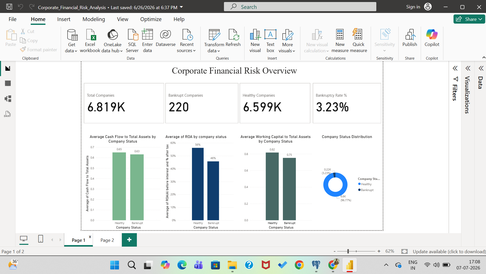
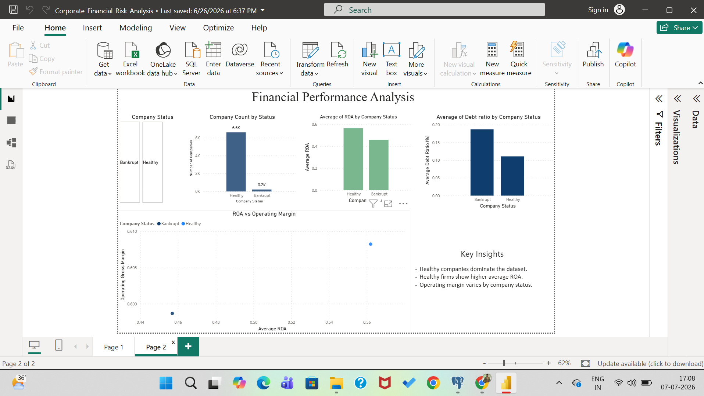

# 📊 Corporate Financial Risk Analysis Dashboard

## Project Overview

Developed an interactive Power BI dashboard to analyze corporate financial risk and bankruptcy trends using financial indicators. The dashboard helps stakeholders monitor KPIs, compare company performance, and identify potential financial risks.

---

## Tools Used

- Power BI
- Power Query
- DAX
- CSV Dataset

---

## Dashboard Features

- Executive KPI Cards
- Bankruptcy Rate Analysis
- ROA Comparison
- Debt Ratio Analysis
- Cash Flow Analysis
- Financial Performance Dashboard
- Interactive Filtering

---

## Key Insights

- Bankruptcy Rate: **3.23%**
- Healthy companies represent **96.77%** of the dataset.
- Healthy companies demonstrate stronger financial performance than bankrupt companies.

---

## Dashboard Preview

### Corporate Financial Risk Overview

### Financial Performance Analysis

---

## Skills Demonstrated

- Power BI
- Power Query
- DAX
- Data Visualization
- KPI Dashboard Development
- Financial Analysis
- Business Intelligence
